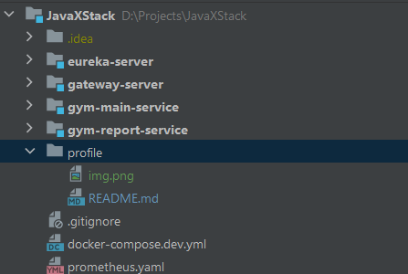
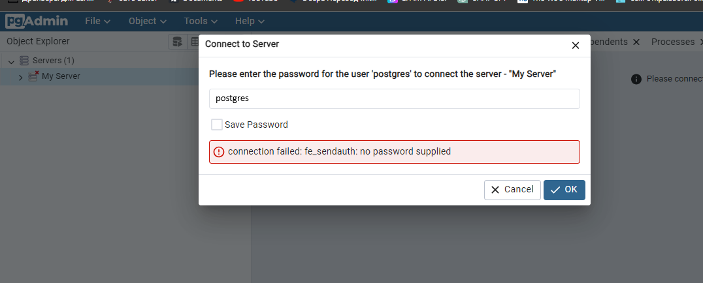

# Before you get started, make sure you have the right project structure in place:

1) U must have 4 modules:
   1) **eureka-server**
   2) **gateway-server**
   3) **gym-main-service**
   4) **gym-report-service**
2) docker-compose.dev.yml located on a level with other modules

## How to run in docker:
1) Use "**mvn clean install**" in all modules folder for creating .jar
2) Use "**docker build -t gym-main .**" to create image from .jar in all modules
   1) Use "**docker build -t gym-main .**" in gym-main-service module
   2) Use "**docker build -t gym-report .**" in gym-report-service module
   3) Use "**docker build -t eureka .**" in eureka-server module
   4) Use "**docker build -t gateway .**" in gateway-server module
3) In docker-compose u have ability to change the type of access to services, this is the responsibility of the variable  **INTERACTION_BETWEEN_MICROSERVICES** possible variants:
   1) **activemq** to use Artemis ActiveMQ client to communicate between gym-main and gym-report services
   2) **feign** to use OpenFeign client (REST calls) to communicate between gym-main and gym-report services
4) Use "**docker-compose -f docker-compose.dev.yml up -d**" to up containers
5) To open swagger use **http://localhost:8080/swagger-ui/index.html#/**
6) Optional: if u want to check db, use pgAdmin via this link: **http://localhost:80/**
    - user: **pgadmin4@pgadmin.org**
    - password: **postgres**
7) Then use password to registry server:
   
8) Prometheus works after deploying docker-compose at  **http://localhost:9090/**
